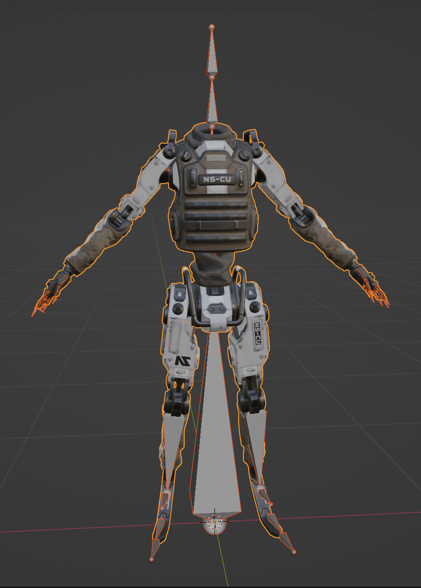
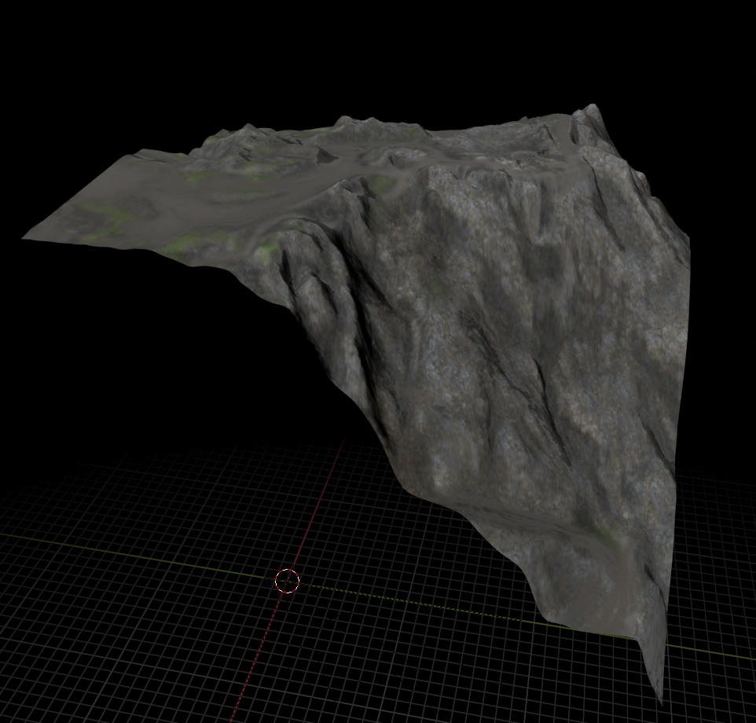
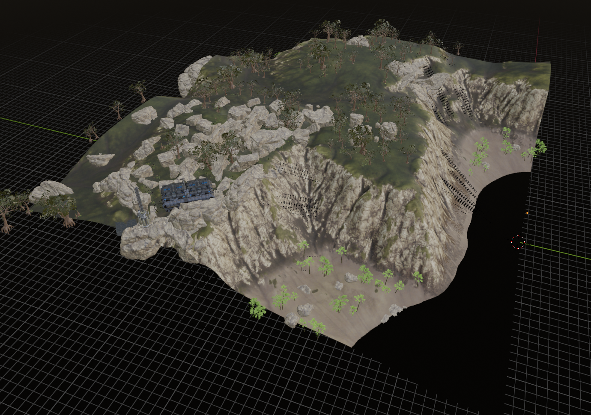

# Warpgate
C++ libraries and tools for exporting 3D models from Planetside 2 Forgelight game assets

This is a C++ port of [PyDMOD](https://github.com/ryanjsims/pydmod)

## Requirements
### Windows
* Visual Studio 2022 with Desktop Development with C++ component
### Linux
* GCC 12.1+/Clang 15+ (for C++20 features)
* Intel Thread Building Blocks (for parallel `std::for_each` loops)
    * Debian/Ubuntu: `sudo apt install libtbb-dev`
### Both
* CMake

## Build instructions
1. Clone the repository and its submodules:
    * CLI: `git clone https://github.com/ryanjsims/warpgate --recurse-submodules`
    * VS Code:
        1. Open the command palette with `Ctrl-Shift-P`
        2. Type `Git: Clone (Recursive)` and hit Enter
        3. Enter the repo url (`https://github.com/ryanjsims/warpgate`)

2. Configure the project with CMake:
    * Unix: `cd warpgate && mkdir build && cd build && cmake ..`
    * VS Code: The CMake extension should ask to configure the repo after it is cloned.

3. Build the project:
    * Unix: `make -j6`
    * VS Code: `Ctrl-Shift-B` and select "CMake: build"

## Installation
`TODO`: Installation CMake commands are not currently implemented for these tools

## Extracting Assets
All of the following tools assume your Planetside 2 Test server installation is at `C:/Users/Public/Daybreak Game Company/Installed Games/PlanetSide 2 Test/Resources/Assets`. If you are using the steam client or have changed the installation location, you will need to use the `--assets-directory` argument to change the directory searched for `.pack2` files.

Additionally when exporting to a GLTF2 file, the format flag `-f` is required to specify either Binary or JSON (`glb/gltf`) output. Binary output bundles all the vertex data into the output file, while JSON output will create many `.bin` files containing the vertex data alongside the `.gltf` file. Both options save textures in a separate `textures/` directory in the same location as the output file.

### 3D Models
Using `dme_converter(.exe)` you can export `.dme` files as `.gltf/.glb` files, including textures and skeletons when present.

A basic (Windows) example starting from the repository root directory would be:
```powershell
.\build\Release\dme_converter.exe -v -f glb Armor_Common_Male_Skins_Base_LOD0.dme export/models/nso/armor/base.glb
```
This exports the NSO base character model along with its skeleton and textures to the `./export/models/nso/armor/` directory, creating directories as needed.

When imported in Blender the model will appear like so:



If you use the Rigify Blender extension, adding the `--rigify` flag to the command will name the bones of humanoid models such that the model can be parented directly to a generated rig without renaming any vertex groups. This means you can create a single humanoid rig and add models to it with very little effort.

### Chunks
Terrain chunks can be exported using the `chunk_converter(.exe)` tool.

Example (Windows):
```powershell
.\build\Release\chunk_converter.exe -f glb Amerish_0_0.cnk0 export\chunks\amerish\0_0.glb -v
```

When imported in Blender:



### Zones
Continents or portions of continents can be exported using the `zone_exporter(.exe)` tool. Exporting full continents tends to be a lot of data, so the tool includes an axis-aligned bounding box (aabb) argument to restrict the area exported.

Example (Windows):
```powershell
.\build\Release\zone_converter.exe -f glb Oshur.zone .\export\continents\oshur\oshur.glb -v --aabb -256 -256 256 256
```

This example exports the center 4 chunks of Oshur and the objects contained in their area.

When imported in Blender:



### General Exports
General files may be directly exported using the `export(.exe)` tool. The tool takes an input filename and output filename for basic exports.

Example (Windows):
```powershell
.\build\Release\export.exe Models.txt export\txt\Models.txt
```

Files may be exported compressed using the `--raw` flag, otherwise they will be decompressed (if applicable) before export.

All files of a specific magic (bytes at the beginning of the file data) may be exported using the `--by-magic` flag. In this case the input filename is instead used as the magic to be exported, and the output filename is instead used as an export directory. 

Non-ascii bytes in the magic may be specified using `\xXX` notation, for example to export all `*X64.mrn` files one would use:
```powershell
.\build\Release\export.exe "\x1a\x00\x00\x00\x0a\x00\x00\x00\x10" export\mrn\
```

The magic may be more than 4 bytes, though typically file magics are 4 bytes long.

The output files will be named `{namehash}.bin` in the output directory.

## Known issues
* Some models have bones that are not detailed by the MRN files, so their hierarchy will not be properly exported, and their pose will need to be reset in Blender before they appear correct.
